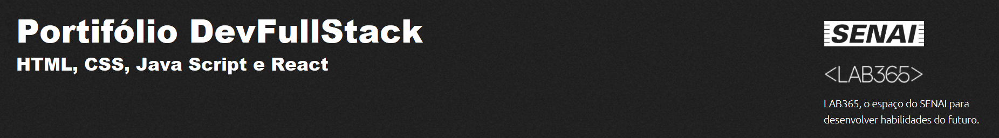

### Projeto de Avaliação do Módulo 1.

A LABPharmacy Inc, uma renomada empresa do ramo farmacêutico, está expandindo a sua rede de lojas. Por conta da expansão, o time de gestão necessita da criação de um sistema online, intitulado Pharmacy Central System, para gerenciamento de medicamentos e farmácias. O seu perfil chamou a atenção dos gestores para a criação do protótipo front-end do sistema que deverá ser codificado em React.

- Login e Signin
- Dados da Unidade (farmácias)
- Dados dos Medicamentos
- Apresentação dos dados dos Medicamentos em forma de Card
- Apresentação dos dados das Farmácias (Mapa ou Lista)

A Imagem abaixo indica o estado de deploy da aplicação
[](https://app.netlify.com/sites/soft-appfarma/deploys)

Para utilizar este projeto como base, faça o seguinte passo-a-passo:

- Clone o projeto para a sua máquina

```bash
https://github.com/EricoCoutoJr/DevFullStack---AVM1.git
```

Obs: necessário configurar SSH [(veja como clicando aqui)](https://www.youtube.com/watch?v=n-H1eFSsugo)

- Instale as dependências (lembre-se de acessar a pasta correta no terminal)

```bash
npm install
```
- Além disso devem ser instaladas com as seguintes libs.
-```bash
npm install react react-dom react-hook-form react-router-dom react-leaflet leaflet
```

- Rode o projeto

```bash
npm run dev
```

### Observações

É necessário iniciar o servidor 'json-serve. Para isso basta rodar o
NPM como descrito abaixo. O servidor já está configurado.

```bash
npm run serve
```
